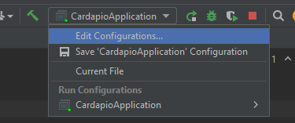
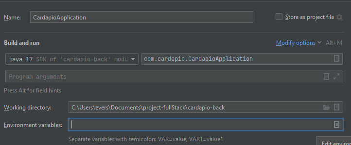
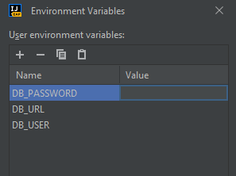

# Cardápio Food - Back End
<div style="text-align: justify">
Projeto realizado para prática de conceitos com objetivo acadêmico.

A aplicação foi desenvolvida usando Java e SpringBoot.

Inicialmente a aplicação foi espelhada no projeto de <a href="https://github.com/Fernanda-Kipper/frontend-cardapio-digital">Fernanda Kipper</a>.


## Tecnologias utilizadas
- SpringBoot
- Java


<h2 id="pre-requisites">💻 Requisitos</h2>

Para rodar esse projeto você precisa ter o Java instalado na sua máquina.

<h2 id="how-to-use"> 🚀 Instalando o projeto</h2>

Primeiro você deve clonar o repositório,

```bash
# Clone o repositório
$ git clone https://github.com/Eor13/cardapio-back.git

# Acesse-o
$ cd crud-java-back
```

Agora, dentro do IntelliJ, vamos instalar as depedências com o Maven


Será necessário informar dados do seu Banco de Dados nas Variáveis de Ambiente do IntelliJ, nesse projeto foi usado o BD Postegres.







E por fim, entre no arquivo da classe `CardapioApllication` para executar o projeto

 

<h2 id="related"> Integração com Frontend</h2>

Para realizar a integração com o Frontend, você pode clonar o projeto e rodar localmente.

👉 [Link do repositório](https://github.com/Eor13/cardapio-front)
